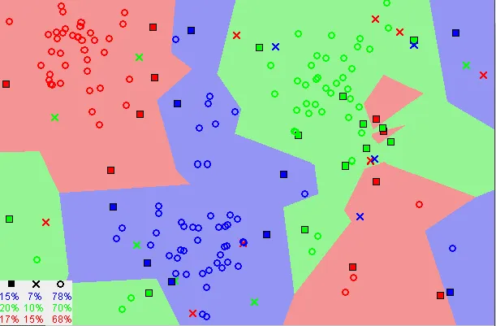

# KNN Based Classification on a Small Subset of CIFAR-10 Dataset
## Introduction
Humans poses a great capability in visual recognition tasks even though they may vary in size, pose, scale, and illumination. In the past many studies have been published to add human intelligence in computers. Recently, ```deep neural networks``` have shown great performance in visual perception tasks and have reported to surpass humans. Yet there is lack of thorough and fair comparison between human and artificial recognition systems.  ```CIFAR-10 dataset```, a well know dataset of natural images. This dataset allows fair comparison with state-of-the-art deep neural networks. ```Convolutional neural networks``` show great performance on the benchmark dataset; however, they are still far from human recognition capabilities. Moreover, a detailed investigation using multiple levels of difficulty reveals that easy images for humans may not be easy for deep neural networks. [1] 


Figure 1:  CIFAR10 dataset image [1]

The ```CIFAR-10``` dataset (Canadian Institute for Advanced Research, 10 classes) is a subset of the Tiny Images dataset and consists of ```60000 32x32``` color images. The images are labelled with one of ```10``` mutually exclusive classes: airplane, automobile (but not truck or pickup truck), bird, cat, deer, dog, frog, horse, ship, and truck (but not pickup truck). There are ```6000``` images per class with ```5000``` training and ```1000``` testing images per class. [2]

## The K-NN Algorithm
The KNN algorithm assumes similar things exist in proximity. In simple words, similar things are near to each other. 



Figure 2: KNN algorithm on a dataset [3]

Notice in the above image similar data points are close to each other and they form a pattern. In addition, there is a boundary between each group which separate one group from another. [3] The complete alogrithm is follows:

- Load the dataset
- Initialize the value of ```K``` to chosen number of neighbors 
- For ```each example``` in the dataset
   - Calculate the distance between the query image and the training image in the dataset
   - Add the distance and the index of the example to the ordered collection
- Sort the ordered collection in ascending order by the distance value
- Pick the first ```K``` entries from the sorted collection
- Get the corresponding labels for the selected entries
- if Regression problem, then return the mean of ```K``` labels
- if Classification problem, then return the mode of ```K``` labels

## Installation
 ```bash
 git clone https://github.com/faizan1234567/Assignments.git
 cd Assignments/DL/
```
Create and activate Anaconda Environment
```bash
conda create -n knn python=3.9.0
conda activate knn
```
Now install all the required dependencies
```bash
pip install --upgrade pip
pip install -r requirements.txt
```
Installation Complete !

## Usage
To get play with data loading, run the following script
```python
python dataset.py -h
```
To train on your dataset
```python
python knn.py -h
python knn.py -s 20 -k 3 --default
```
If you face any issue in installation and usage, please create an issue. If you have any ideas for improvments kindly create a PR.

**Note**: This assignment is under development, you may report some bugs by creating an issue. New set of featuers will be added and code will be updated ASAP. Please feel free to use it for testing and learning purposes. PRs always welcome. 

## TODO
- Custom dataset loading support
- enhancing KNN by experimenting with different K values
- Data visualizing features such confusion matrix and classification report

## Ablation Study
The results are reported on ```30``` images (```24``` of them used for training) and rest of them used for evaluation. In this study, two distance metrics are considered such as Manhatten distance and euclidean distance. Value of K (nearest neighbours ) were varied between ```1 - 5``` to check the model performance. In this study, precision, recall, f1-score, and accuracy are considered as model performance measurement metrics. We are considering Macro average and weighted avearge.

**Manhatten Distance**

<table>
<tr><th>Macro Averge </th><th>Weighted Average </th></tr>
<tr><td>

| K value | Precision| Recall | F1-score | Accuracy |
|----------|----------|----------|----------|----------|
| 1 | 0.61 | 0.5  |0.52| 0.5 |
| 2 | 0.61 |  0.5 |0.52| 0.5 |
| 3 | 0.47 | 0.5  |0.41| 0.5 |
| 4 | 0.47 | 0.5  |0.41| 0.5 |
| 5 | 0.5  | **0.67** |**0.56**| **0.67**|

</td><td>

| K value | Precision| Recall | F1-score | Accuracy |
|----------|----------|----------|----------|----------|
| 1 | 0.61 | 0.5  |0.52| 0.5 |
| 2 | 0.61 |  0.5 |0.52| 0.5 |
| 3 | 0.47 | 0.5  |0.41| 0.5 |
| 4 | 0.47 | 0.5  |0.41| 0.5 |
| 5 | 0.5  | **0.67** |**0.56**| **0.67**|

</td></tr> </table>


**Euclidean Distance**

<table>
<tr><th>Macro Average </th><th>Weighted Average </th></tr>
<tr><td>

| K value | Precision| Recall | F1-score | Accuracy |
|----------|----------|----------|----------|----------|
| 1 | 0.61 | 0.5  |0.52| 0.5 |
| 2 | 0.61 | 0.5  |0.52| 0.5 |
| 3 | 0.47 | 0.5  |0.41| 0.5 |
| 4 | 0.47 | 0.5  |0.41| 0.5 |
| 5 | 0.5  | 0.5  |0.44| 0.5 |
| 6 | 0.5  | **0.67** |**0.56**| **0.67**|
| 7 | 0.5  | 0.67 |0.56| 0.67|
</td><td>

| K value | Precision| Recall | F1-score | Accuracy |
|----------|----------|----------|----------|----------|
| 1 | 0.61 | 0.5  |0.52| 0.5 |
| 2 | 0.61 | 0.5  |0.52| 0.5 |
| 3 | 0.47 | 0.5  |0.41| 0.5 |
| 4 | 0.47 | 0.5  |0.41| 0.5 |
| 5 | 0.5  | 0.5  |0.44| 0.5 |
| 6 | 0.5  | **0.67** |**0.56**| **0.67**|
| 7 | 0.5  | 0.67 |0.56| 0.67|
</td></tr> </table>


Table: experimental resluts


## Disclaimer
The purpose of open sourcing this repository for those who want to learn and they are stuck in implementation, aim of this repo is to speed up their development. 

## References
[1]	T. Ho-Phuoc, “CIFAR10 to Compare Visual Recognition Performance between Deep Neural Networks and Humans,” 2018, [Online]. Available: http://arxiv.org/abs/1811.07270

[2]	“CIFAR10 dataset description.” [Online]. Available: https://paperswithcode.com/dataset/cifar-10

[3] O. Harrison, “machine learning with K Nearest Neighbor algorithm.” 2018. [Online]. Available: https://towardsdatascience.com/machine-learning-basics-with-the-k-nearest-neighbors-algorithm-6a6e71d01761

